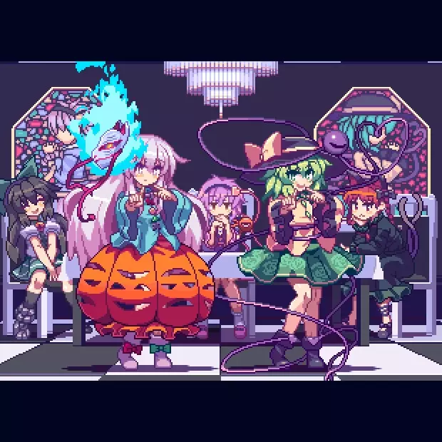

  

## Hi, I'm UrNightmaree
  
**A student, weeb and love programming 🤠💻**

### About Me 🤔
 * Live in Indonesia 🇮🇩
 * Love programming (not hacking) 💻
 * Use Termux (mostly) for coding 📱

### Projects & Works 📚
 * Done projects:
    * **[tluvit](https://github.com/UrNightmaree/tluvit)** 
    A [Teal](https://github.com/teal-language/tl) (.tl) runner for [Luvit](https://luvit.io) runtime.
    * **[dotenv-lua](https://github.com/UrNightmaree/dotenv-lua)** 
    A .env parser for Lua environment which is available through [Luarocks](https://luarocks.org) and [Lit](https://github.com/luvit/lit)!:
    * **[Shocket](https://github.com/UrNightmaree/shocket)** 
    A Bash library for easier interacting with WebSocket.
 * In-works projects:
    * **[Vyn](https://github.com/UrNightmaree/Vyn)** 
    An experimental tool for creating Vim syntax highlighting without touching Vimscript!

---

